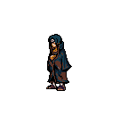

<table align="center">
  <tr>
    <td>
      <b>
        <a href="../readme.md">🇧🇷 Português</a>
      </b>
    </td>
    <td>
      <b>
        <a href="../readme-en.md">🇺🇸 English</a>
      </b>
    </td>
  </tr>
</table>

  

   &nbsp; &nbsp;  &nbsp; &nbsp; &nbsp; &nbsp; &nbsp; &nbsp; &nbsp; &nbsp; &nbsp; &nbsp; &nbsp;

    

    <h2>👨‍💻About me</h2>
    
     📌 Since 06/14/22 I study <b><i>Web Development</i></b>, mastering the technologies to become a <b>Front-end Developer.</b>

    💆🏽‍♂️ I am always seeking knowledge daily. I can quickly learn what is needed to keep the process going. I believe we always need to learn, think outside the box and step out of our comfort zone.
  
    🧬 Soft Skills: Teamwork, proactive, communicative, creative thinking.

    

      <h2> ⚡ Hard skill</h2>
       &nbsp;  
       &nbsp;
       &nbsp;
       &nbsp;
       &nbsp;
       &nbsp;
       &nbsp; 
    

     
    <h2>📚Technologies I am currently studying</h2>
      &nbsp;  
       &nbsp;
       &nbsp;

 
<h2 align="center">🌐Where to find me</h2>
  

    <a href="https://github.com/jonathandesb" target="_blank">
      &nbsp;&nbsp; 
    </a>
    <a href="mailto:jonathandsb20@gmail.com">
       &nbsp; 
    </a>
    <a href="https://t.me/jonthandesb" target="_blank">
    &nbsp; 
    </a>
    <a href="https://www.linkedin.com/in/jonathan-de-sousa-064a5722a/" target="_blank">
      &nbsp; 
    </a>
    <a href="https://www.instagram.com/jonathandesb_/" target="_blank">
    &nbsp; 
    <a href="https://www.behance.net/jotartes">
      &nbsp; 
    </a>
    <a href="https://www.deviantart.com/zyoshii" target="_blank">
      &nbsp; 
    </a>
  

  

